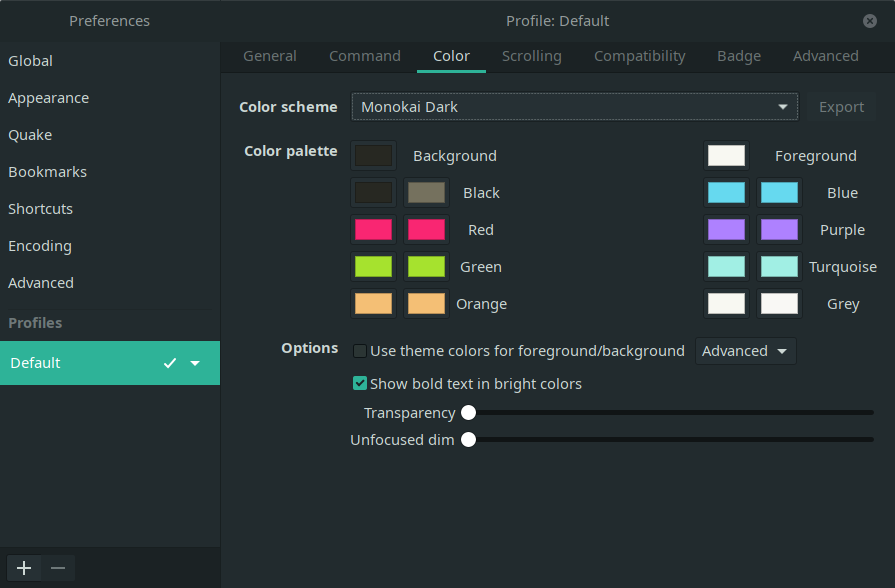

# Manjaro Setup

## Install Script

```shell
$ set -e
$ sudo pacman -Syyu
```

Start calling scripts

## Base Install

```shell
mkdir -p $HOME/bin $HOME/.local/bin/

sudo pamac install bash-completion

if [ -f "$HOME/.bashrc" ]; then
    mv "$HOME/.bashrc" "$HOME/.bashrc-original"
fi

wget -O "$HOME/.bashrc" $HOME/.bashrc https://raw.githubusercontent.com/joeparis/dotfiles/master/base_bashrc

if [ -f "$HOME/.profile" ]; then
    mv "$HOME/.profile" "$HOME/.profile-original"
fi

wget -O "$HOME/.profile" https://raw.githubusercontent.com/joeparis/dotfiles/master/manjaro_profile

if [ -f "$HOME/.bash_aliases" ]; then
    mv "$HOME/.bash_aliases" "$HOME/.bash_aliases-original"
fi

wget -O $HOME/.bash_aliases https://raw.githubusercontent.com/joeparis/dotfiles/master/bash_aliases

if [ -f "$HOME/.dircolors" ]; then
    mv "$HOME/.dircolors" "$HOME/.dircolors-original"
fi

wget -O "$HOME/.dircolors" https://raw.githubusercontent.com/joeparis/dotfiles/master/dircolors

mkdir -p "$HOME/.lectures/"

wget -O "$HOME/.lectures/groot-lecture" https://raw.githubusercontent.com/joeparis/dotfiles/master/groot-lecture

touch "$HOME/lecture"

echo -e "Defaults\tlecture = always" >> "$HOME/lecture"
echo -e "Defaults\tlecture_file = $HOME/.lectures/groot-lecture" >> "$HOME/lecture"

chmod 444 lecture
sudo chown root:root lecture

sudo mv lecture /etc/sudoers.d/

# set up root's environment
sudo su
if [ -f /root/.bashrc ]; then
    mv /root/.bashrc /root/.bashrc-original
fi

wget -O /root/.bashrc https://raw.githubusercontent.com/joeparis/dotfiles/master/root_bashrc

if [ -f /root/.dircolors ]; then
    mv /root/.dircolors /root/.dircolors-original
fi

wget -O /root/.dircolors https://raw.githubusercontent.com/joeparis/dotfiles/master/dircolors
chmod 644 /root/.dircolors
```

## CLI Tooling

```shell
sudo pamac install cowsay fortune-mod glances htop httpie imagemagick lolcat most pandoc-citeproc pandoc-crossref python-argcomplete texlive-most biber texmaker tmux xclip youtube-dl pandoc

pamac build toilet toilet-fonts
```

```shell
## Python

wget -O get-pip.py https://bootstrap.pypa.io/get-pip.py

sudo -H python3 get-pip.py

pip3 install --user pipx
"$HOME/.local/bin/pipx" install black
"$HOME/.local/bin/pipx" install pipenv
"$HOME/.local/bin/pipx" install pytest
"$HOME/.local/bin/pipx" install pylint
"$HOME/.local/bin/pipx" install pydocstyle
"$HOME/.local/bin/pipx" install pycodestyle
"$HOME/.local/bin/pipx" install terminal-colors
"$HOME/.local/bin/pipx" install Pygments

echo -e '\n## Python pipx\neval "$(register-python-argcomplete pipx)"' >> "$HOME/.bashrc"
```

## Bash-it

```shell
git clone --depth=1 https://github.com/Bash-it/bash-it.git "$HOME/.bash_it"
"$HOME/.bash_it/install.sh" --no-modify-config

mkdir -p "$HOME/.bash_it/custom/themes/joe1" && wget -O "$HOME/.bash_it/custom/themes/joe1/joe1.theme.bash" https://raw.githubusercontent.com/joeparis/dotfiles/master/joe1.theme.bash

echo -e '\n##bash-it\n# Path to the bash-it configuration\nexport BASH_IT="$HOME/.bash_it"' >> "$HOME/.bashrc"
echo -e '\n# Lock and Load a custom bash-it theme file location /.bash_it/themes/\nexport BASH_IT_THEME="joe1"' >> "$HOME/".bashrc
echo -e "\n# Don't check mail when opening terminal.\nunset MAILCHECK" >> "$HOME/.bashrc"
echo -e '\n# Set this to false to turn off version control status checking within the prompt for all themes\nexport SCM_CHECK=true' >> "$HOME/.bashrc"
echo '. "$BASH_IT"/bash_it.sh' >> "$HOME/.bashrc"

sudo pip3 install thefuck

ln -s "$HOME/.bash_it/aliases/available/fuck.aliases.bash" "$HOME/.bash_it/enabled/150---fuck.aliases.bash"
ln -s "$HOME/.bash_it/plugins/available/explain.plugin.bash" "$HOME/.bash_it/enabled/250---explain.plugin.bash"
ln -s "$HOME/.bash_it/plugins/available/less-pretty-cat.plugin.bash" "$HOME/.bash_it/enabled/250---less-pretty-cat.plugin.bash"
ln -s "$HOME/.bash_it/plugins/available/tmux.plugin.bash" "$HOME/.bash_it/enabled/250---tmux.plugin.bash"
```

## nano

```shell
wget -O "$HOME/.nanorc" https://raw.githubusercontent.com/joeparis/dotfiles/master/nanorc

wget -O - https://raw.githubusercontent.com/scopatz/nanorc/master/install.sh | sh
```

## VIM

```shell
sudo pamac install vim

mkdir -p $HOME/.vim/colors/

wget -O "$HOME/.vim/colors/cobalt2.vim" https://raw.githubusercontent.com/joeparis/dotfiles/master/cobalt2.vim
wget -O "$HOME/.vim/colors/monokai.vim" https://raw.githubusercontent.com/joeparis/dotfiles/master/monokai.vim
wget -O "$HOME/.vim/colors/solarized8.vim" https://raw.githubusercontent.com/lifepillar/vim-solarized8/master/colors/solarized8.vim
wget -O "$HOME/.vim/colors/solarized8_flat.vim" https://raw.githubusercontent.com/lifepillar/vim-solarized8/master/colors/solarized8_flat.vim
wget -O "$HOME/.vim/colors/solarized8_high.vim" https://raw.githubusercontent.com/lifepillar/vim-solarized8/master/colors/solarized8_high.vim
wget -O "$HOME/.vim/colors/solarized8_low.vim" https://raw.githubusercontent.com/lifepillar/vim-solarized8/master/colors/solarized8_low.vim
wget -O "$HOME/.vimrc" https://raw.githubusercontent.com/joeparis/dotfiles/master/vimrc
```
```shell

## GUI Tooling

```
```shell
sudo pamac install asciinema cool-retro-term dconf-editor gimp handbrake handbrake-cli inkscape kdenlive krita obs-studio peek simplescreenrecorder perl-term-animation perl-tk tilix ttf-fira-code ttf-font-awesome

sudo pamac bless build otf-fira-code-symbol shutter
```

### VSCode Insiders

```shell
pamac build visual-studio-code-insiders
wget -O - http://bit.ly/30fJShW > .config/Code\ -\ Insiders/User/settings.json
code-insiders --install-extension Shan.code-settings-sync
```

### screenkey

```shell
pamac build screenkey-git
sudo pamac install libappindicator-gtk2 libappindicator-gtk3 python2-libappindicator
```

### Thonny

```shell
bash <(wget -O - https://thonny.org/installer-for-linux)

### Google Chrome **_(optional)_**

pamac build google-chrome google-chrome-dev
```

## Wrap Up

```shell
wget -O - https://raw.githubusercontent.com/joeparis/dotfiles/master/wrap-up-install.sh | bash
```

## Misc.

* Configure terminal(s) to be 132x42 characters, change font(?), and fix color scheme"
  * Gnome Terminal"
    "
  * Tilix"
    "
* Enable dash to dock extension"
  * Turn on intelligent autohide"
  * Intelligent autohide settings:"
    * Turn off dodge windows"
  * Turn off panel mode"
  * Adjust icon size"
* Install gnome extensions add-on in Firefox and `sudo pacman -S chrome-gnome-shell`"
* Install **caffeine**, **bing wallpaper changer**, and **icon area horizontal spacing** "extensions
* To fix Gnome grabbing ctrl+alt+up_arrow and ctrl+alt+down_arrow,"
  * open `dconf`"
  * navigate to `/org/gnome/desktop/wm/keybindings/`"
  * edit `switch-to-workspace-up`, `switch-to-workspace-down`, `move-to-workspace-down`, and `move-to-workspace-up`"
